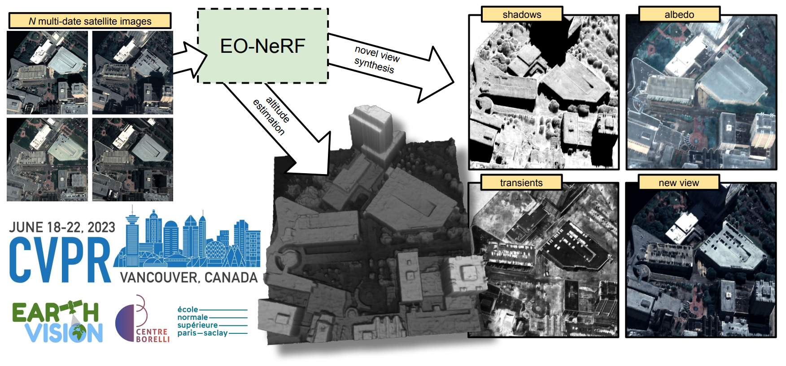

# EO-NeRF

### [[Project page]](https://rogermm14.github.io/eonerf)

Developed at the [ENS Paris-Saclay, Centre Borelli](https://centreborelli.ens-paris-saclay.fr/fr) and accepted at the [CVPR EarthVision Workshop 2023](https://www.grss-ieee.org/events/earthvision-2023/).

### [Multi-Date Earth Observation NeRF: The Detail Is in the Shadows](https://openaccess.thecvf.com/content/CVPR2023W/EarthVision/papers/Mari_Multi-Date_Earth_Observation_NeRF_The_Detail_Is_in_the_Shadows_CVPRW_2023_paper.pdf)
*[Roger Marí](https://rogermm14.github.io/),
[Gabriele Facciolo](http://dev.ipol.im/~facciolo/),
[Thibaud Ehret](https://tehret.github.io/)*



> **Abstract:** *We introduce EO-NeRF, the Earth Observation NeRF. This method can be used for digital surface modeling and novel view synthesis using collections of multi-date remote sensing images. In contrast to previous variants of NeRF for satellite imagery, EO-NeRF outperforms the altitude accuracy of advanced pipelines for 3D reconstruction from multiple satellite images, including classic and learned stereo-based methods. This is largely due to a rendering of building shadows strictly consistent with the geometry of the scene and independent from other transient phenomena. A number of strategies are additionally presented with the aim to exploit satellite imagery out of the box, without requiring usual pre-processing steps such as a relative radiometric normalization of the input images or a bundle adjustment of the associated camera models. We evaluate our method on different areas of interest using sets of 10-20 true color and pansharpened WorldView-3 images.*

If you find this code or work helpful, please cite:
```
@InProceedings{Mari_2023_CVPR,
    author    = {Mar{\'\i}, Roger and Facciolo, Gabriele and Ehret, Thibaud},
    title     = {Multi-Date Earth Observation NeRF: The Detail Is in the Shadows},
    booktitle = {Proceedings of the IEEE/CVF Conference on Computer Vision and Pattern Recognition (CVPR) Workshops},
    month     = {June},
    year      = {2023},
    pages     = {2034-2044}
}
```
